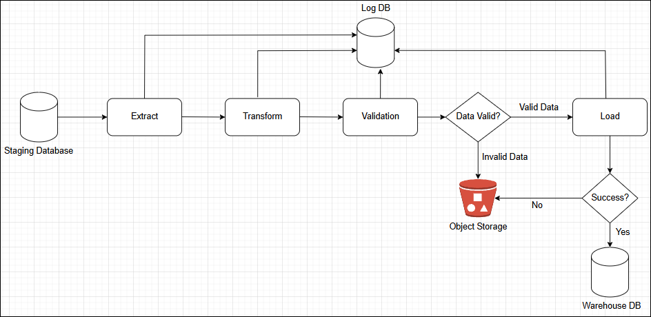

# Data Integration and ETL Pipeline

## Table of Contents
* [Identify Data](#identify-data)
* [Requirement Gathering and Solutions](#requirement-gathering-and-solutions)
* [Data Pipeline Design](#data-pipeline-design)

## Identify Data
### a. Data Source
A data source refers to the origin of data that is used in an application, analytics, or a data pipeline. In this project, there are two main data sources:
1. PostgreSQL Database: Contains structured data related to customers, employees, orders, products, inventory tracking, and order details.
2. Google Spreadsheet: Stores branch-related information (store_id, store_name, created_at)

### b. Data Sink
A data sink is the destination where all extracted data from the sources (PostgreSQL & Google Spreadsheet) will be stored after processing. In this project, there are two type data sink destinations:
1. Staging Area  
The staging area processes the data from the data sources and google spreadsheet and then stores it in a structured format. After processing, the data is then loaded into the data warehouse for further processing.
The pipeline process contains the following steps:
    - Extract data from the data sources
    - Load the data into the staging area
2. Data Warehouse  
Data warehouse used for storing the processed data from the staging area. The data warehouse is used for reporting and analytics purposes.
The pipeline process contains the following steps:
    - Extract data from the staging area
    - Transform the data
    - Validation the data
    - Load the data into the data warehouse

### c. Tech Stack
The following technologies are used in this project:
- Python
- PostgreSQL
- Google Spreadsheet
- Docker
- Minio
- Sentry

## Requirement Gathering and Solutions
### a. Business Requirements
1. Integrate data from multiple sources (PostgreSQL and Google Spreadsheet).
2. Process and store data in a staging area before loading it into a data warehouse.
3. Ensure data quality and consistency during the ETL process.

### b. Solutions
1. Staging Pipeline
- Data Extraction  
Develop Python scripts to extract data from PostgreSQL and Google Spreadsheet.
Use Google Sheets API for fetching store branch data.
Use SQL queries for extracting data from PostgreSQL.
- Data Loading (to Staging DB)  
Load extracted data into a Staging Database (PostgreSQL).
Store raw data without transformations to preserve original records.
2. Warehouse Pipeline
- Data Extraction (from Staging DB):
Extract data from Staging Database for processing.
Ensure data consistency and deduplication.
- Data Transformation:
Implement formatting, and business logic transformations.
Normalize inconsistent data and apply necessary aggregations.
- Data Validation
Implement validation to ensure data quality, integrity, and consistency before it is used for reporting and analytics.
Data Loading (to Warehouse DB):
- Load the transformed data into the Data Warehouse.
Ensure the schema is optimized for analytics and reporting.

## Data Pipeline Design
### a. Staging Pipeline

### b. Warehouse Pipeline

